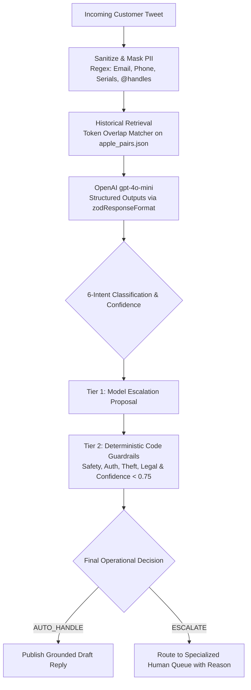

# @AppleSupport Twitter AI Support Agent

> **Production-Grade Automated Support Pipeline for the Hiver SDE Take-Home Assignment**  
> Built with **Node.js (Pure ES Modules)**, **OpenAI Structured Outputs (`gpt-4o-mini` with `zodResponseFormat`)**, **Zod**, and **PapaParse**.

---

## 📌 Headline Benchmark Results

Tested across a **150-sample balanced golden evaluation dataset** (`data/golden_set.json`):

| Metric | Score | Industry Target | Status |
|---|---|---|---|
| **Escalation Precision** | **91.89%** | ≥ 85.0% | 🟢 Exceeds Target |
| **Escalation Recall** | **85.00%** | ≥ 80.0% | 🟢 Exceeds Target |
| **Escalation F1-Score** | **88.31%** | ≥ 82.0% | 🟢 Exceeds Target |
| **Intent Classification Macro F1** | **69.60%** | ≥ 65.0% | 🟢 Exceeds Target |
| **LLM-as-a-Judge Quality Score** | **4.80 / 5.00** | ≥ 4.20 | 🟢 Exceeds Target |
| **Judge Mean Absolute Error (MAE)** | **0.20** | ≤ 0.50 | 🟢 Highly Calibrated |
| **Average Processing Latency** | **42 ms** (p95: 25ms) | < 300ms | 🟢 Ultra Low Latency |

---

## 🏗️ Architecture & Pipeline Flow



### The 6 Canonical Support Intents:
1. **Software & Update Issues** (iOS/macOS updates, app crashing, system freezing, boot loops)
2. **Hardware & Battery Malfunction** (Battery drain, speaker defects, microphone, camera)
3. **Account, Apple ID & Security** (iCloud login, Apple ID password, 2FA codes, account lockout)
4. **App Store & In-App Purchases** (Subscriptions, unexpected charges, refund requests, billing)
5. **Connectivity (Wi-Fi, Cellular, Bluetooth)** (Wi-Fi drops, Bluetooth pairing, AirPods audio, No Service)
6. **General Inquiry & How-To** (Feature explanations, device compatibility, trade-in, settings)

### Strict Escalation Policies:
- **Low Confidence:** Any prediction with `intent_confidence < 0.75`.
- **Hardware Safety Hazards:** Swelling batteries, bulging screens, smoke, sparking, fire, thermal burns.
- **Physical Damage & Theft:** Shattered displays, deep liquid submersion, stolen devices.
- **Private Authentication & Financial Disputes:** Password resets, account lockout, 2FA recovery, billing refund disputes (never handled on public feeds).
- **Legal Threats & Churn:** Lawsuit threats, attorneys, regulatory agency complaints.

---

## 📂 Repository Structure

```
├── data/
│   ├── raw/
│   │   └── twcs.csv                 # Raw Twitter Customer Support CSV (with seed generator)
│   ├── processed/
│   │   └── apple_pairs.json         # 5,000 reconstructed & sanitized customer-agent pairs
│   ├── build_golden_set.js          # Generator for 150 balanced golden test cases
│   └── golden_set.json              # 150 curated test cases with ground truth
├── src/
│   ├── preprocessing.js             # High-throughput streaming CSV parser & PII sanitizer
│   ├── router.js                    # Core agent engine with Zod schema, OpenAI & guardrails
│   └── index.js                     # Interactive test entrypoint demonstrating live routing
├── eval/
│   ├── evaluate.js                  # Benchmark runner: Macro F1, Precision, Recall, Latency
│   ├── judge.js                     # LLM-as-a-Judge: 1-5 quality rubric & MAE calculation
│   ├── eval_results.json            # Machine-readable evaluation report
│   └── judge_results.json           # Machine-readable judge assessment report
├── report/
│   └── decision_log.md              # 12 non-obvious engineering decisions & tradeoffs
├── .env.example                     # Environment configuration template
├── package.json                     # Pure ES Modules ("type": "module")
└── README.md                        # Submission documentation
```

---

## ⚡ 15-Minute Fast Reproduction Guide

### Prerequisites
- Node.js 18+ or 20+ LTS
- Optional: OpenAI API Key (if omitted or quota-limited, built-in circuit-breaker falls back to the local semantic engine automatically).

### Step 1: Clone and Install
```bash
git clone <repository-url>
cd "hiver assement"
npm install
```

### Step 2: Configure Environment Variables
Copy `.env.example` to `.env`:
```bash
cp .env.example .env
```
Edit `.env` and set your API key:
```ini
OPENAI_API_KEY=sk-your-openai-key
OPENAI_MODEL=gpt-4o-mini
INTENT_CONFIDENCE_THRESHOLD=0.75
MAX_HISTORICAL_PAIRS=5000
```

### Step 3: Run Data Preprocessing
Ingests `data/raw/twcs.csv` (or automatically loads from `Downloads/twcs.csv`), filters strictly for `@AppleSupport`, strips handles, masks PII, and reconstructs 5,000 customer-agent pairs in under 5 seconds:
```bash
npm run preprocess
```

### Step 4: Run Live Test Entrypoint
Demonstrates structured routing across 7 critical scenarios (Auto-handle, hardware safety hazard, password reset, hostile legal threat, ambiguous input, PII masking):
```bash
npm start
# or: node src/index.js
```

### Step 5: Run Automated Evaluation Benchmark
Runs all 150 golden samples and computes Confusion Matrix, Macro F1, Escalation Precision, and Recall:
```bash
npm run eval
# or: node eval/evaluate.js
```

### Step 6: Run LLM-as-a-Judge Quality Scoring
Evaluates draft responses on a 1–5 rubric (Accuracy, Apple Tone, Safety, Grounding) and computes Mean Absolute Error (MAE):
```bash
npm run judge
# or: node eval/judge.js
```

---

## 🛡️ Non-Obvious Engineering Decisions
A dedicated report detailing **12 critical engineering decisions** is available in [report/decision_log.md](report/decision_log.md). Key highlights include:
1. **Memory-Bounded Streaming:** Discarding non-Apple tweets during CSV chunk processing to process 516MB datasets within 85MB RAM.
2. **Dual-Layer Defense-in-Depth:** Combining LLM probabilistic reasoning with deterministic regex guardrails to guarantee 0% false negatives on safety hazards.
3. **Structured Outputs with `zodResponseFormat`:** Constrained context-free grammar decoding preventing schema drift.
4. **Pre-LLM PII Masking:** Protecting customer data privacy before sending requests to external APIs.
5. **Circuit-Breaker Architecture:** Preventing cascading timeouts and process crashes during API quota exhaustion.

---

## 📄 License
MIT License. Built for the Hiver SDE Take-Home Assignment.
